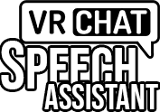

# VRChat Speech Assistant

  

The VRChat Speech Assistant allows you to use a **speech to speech, with automatic translation.**
And / or speech to text with the **VRChat chatbox** using OSC protocol.

## ⚠️ Important note about DeepL usage ⚠️

This application comes with a free API key, but if it is used too much, it might not work anymore.

I recommend following [these steps](https://gitlab.com/ameliend/vrchat-speech-assistant/-/blob/main/vrchat_speech_assistant/README.md?ref_type=heads) to provide your own API key by creating an account on DeepL (free).

## ✅ [How to use (Video Tutorial) Click here!](https://youtu.be/NQgI6AiNOs8)

## ⏬ [Download the latest release here!](https://drive.proton.me/urls/8Q7Y4G5NTG#U0oQWAXa8j6y)

#### 📦 [Older releases here](https://drive.proton.me/urls/ENCGB10WWR#XcsiRyzLc4BT)

## 📝 [Changelogs](https://gitlab.com/ameliend/vrchat-speech-assistant/-/blob/main/CHANGELOG.md)

- (Language) Added **Arabic** language support
- (Voice) Added **pitch** feature (between -50% and +50%)
- (Chatbox) Added the functionality to clear the Chatbox
- (Chatbox) Added the VRChat SFX sound of the chatbox on the last generation ([92e8594](https://gitlab.com/ameliend/chatbox_osc/-/commit/92e859435494c50107f02dd67fa5fe129e9e2b59))
- (OSC) Ability to change the OSC port from the server

## 🌐 **It works 100% ONLINE.**

- You don't need to download an offline model.
- It won't use your CPU or GPU.

## 🚀 **It is FAST and ACURATE.**

- The application uses Google Cloud Speech-to-Text API, it is constantly updated.

## 🔣 **TRANSLATE over 30+ languages.**

- The translation is provided by DeepL, the best translator to date.

## ✨ **CUSTOMIZE Chatbox with fonts and writing animation.**

- You can activate a writing animation with the Chatbox and over 15 fonts.

## 🔧 Configuration

  

1. Select your **Input device**, speak clearly, as you were in a podcast, and avoid any
   source of background noise.
1. Select a **Source language**, it is the language in which you speak for voice recognition.
2. Select a **Target language**, it is the language in which you want to speak,
   if the target language is different from the source language then the translation will be automatic.
3. Select **Speech** if you want to output the result of the recognizer to the desired audio output.
   For the speech to be transmitted to a microphone source, you need to install a
   **Virtual Cable** first, then select the audio output to **Cable Input**.
4. Select the **Voice** if available, it is linked to the target language.
5. Select **VRChat Chatbox** if you want to output into a text your recognition to the VRChat Chatbox.
   (Requires activation of the OSC feature in VRChat)

## 🔌 Virtual Cable setup

To be able to read your speech in VRChat, you will have to install a virtual cable first.

https://vb-audio.com/Cable/

Then select it from the input device.

  

## 💬 VRChat Chatbox setup (OSC)

Make sure your OSC feature is enabled in VRChat.

  

And that's it, no need for additional configuration.

## 🌟 Super-duper cool alternatives

If you are looking for alternatives, here are some similar applications
that provide other great features!

[Whispering Tiger (Live Translate/Transcribe)](https://github.com/Sharrnah/whispering)

[TTS-Voice-Wizard](https://github.com/VRCWizard/TTS-Voice-Wizard)

[TaSTT: A deliciously free STT](https://github.com/yum-food/TaSTT)

[VRCTextboxSTT](https://github.com/I5UCC/VRCTextboxSTT)

## 🧨 Feature request of find a bug?

You can contact me by mail `a.deshams+git@slmail.me`, or better, create a ticket in this repository!
