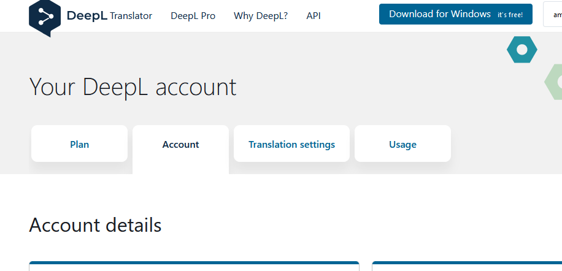
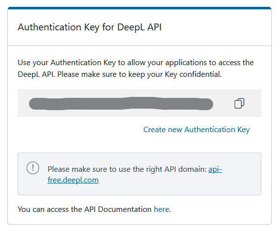
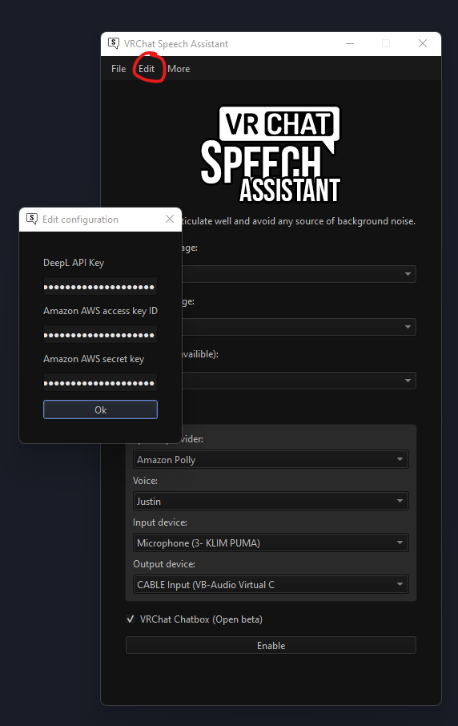
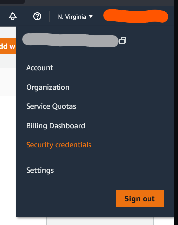
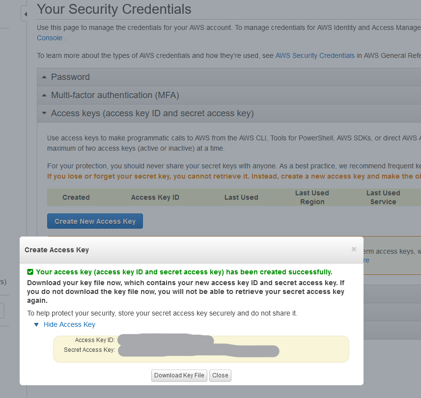

## 🌐 Translator setup

  

This application allows you to automatically **translate what you say into 30 different languages.** It uses the API of DeepL, **one of the best translators in the world. Offering a very short translation time.**

This application comes with a free API key, but if it is used too much it might not work anymore.

You can provide your own API key by creating an account DeepL (free).

  

  

Once you have one, you can then configure it in this application.

  

## 🦜 Amazon Polly setup

  

For now, only Amazon Polly speech is available with this application.

Amazon Polly allows you to use **50+ natural voices** in the language of your choice.

You've probably heard them in apps like Tiktok.

This application comes with free amazon AWS credentials, but if these are used too much they might not work anymore.

You can provide your own credentials by creating an Amazon AWS account (free).

  

  

Once you have them, you can then configure it in this application.

  

